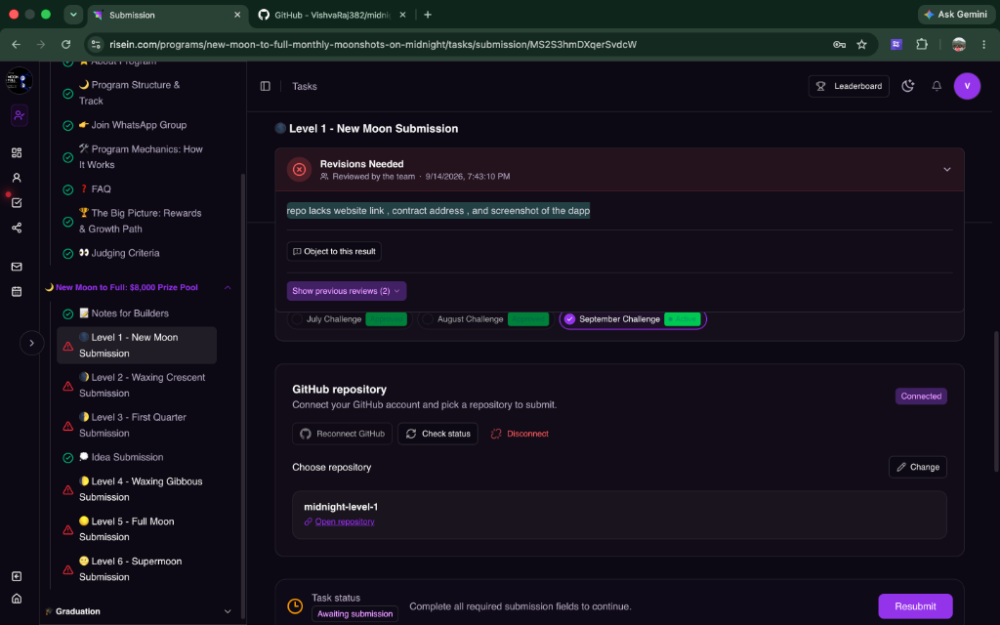

# PrivAI Finance — Privacy-Preserving Financial Eligibility Platform

[](https://midnight.network)
[](docs/evidence/LEVEL3_EVIDENCE.md)
[](.github/workflows/ci.yml)
[](contracts/privai_finance.compact)
[](docs/evidence/LEVEL3_EVIDENCE.md)
[](scripts/deploy.ts)
[](https://midnight-level-1.vercel.app)

> **PrivAI Finance** is a zero-knowledge financial eligibility verification platform on the Midnight Network. It enables users to prove they satisfy financial conditions (such as `"Monthly income >= ₹50,000"`) without revealing their exact sensitive financial records to lenders, platforms, DAOs, or employers.

---

## 🚀 Live Demo & Deployment Information

| | |
| :--- | :--- |
| 🌐 **Live Website** | **[midnight-level-1.vercel.app](https://midnight-level-1.vercel.app)** |
| 📜 **Contract Address** | `0x02008f3a9e4d5882b71946c18f258e7275d312984bc0369811a2f1b490f20d7e` |
| 🔗 **Network** | Midnight Preprod Testnet |
| 👛 **Wallet** | Midnight Lace Wallet (`window.midnight.mnLace`) |
| 🚰 **Faucet** | [faucet.preprod.midnight.network](https://faucet.preprod.midnight.network) |
| 📄 **Proposal** | [PROPOSAL.md](PROPOSAL.md) |

---

## 📸 dApp Screenshot



---

## 💡 Problem & Solution

### The Problem
Traditional financial verification requires applicants to submit raw bank statements, payslips, or tax filings containing sensitive figures. Lenders and platforms only need to know: **"Does this applicant meet the eligibility threshold?"**, yet they are forced to store and process full financial histories, creating severe data breach risks, privacy violations, and regulatory compliance burdens.

### The PrivAI Finance Solution
PrivAI Finance replaces raw financial disclosure with zero-knowledge cryptographic proofs on Midnight:
- **Private Witness**: The applicant's actual salary (e.g., `₹73,500`) stays private inside their local machine / wallet.
- **Authoritative Circuit**: The Midnight Compact smart contract executes `monthlyIncome >= requiredThreshold` in zero-knowledge.
- **Selective Disclosure**: The verifier learns **`ELIGIBLE: YES`** with cryptographic finality, but **NEVER** learns the underlying salary figure (`₹73,500`).
- **Assistive AI Layer**: Natural language criteria (e.g. *"Applicants earning at least 50k INR/month"*) are parsed into structured rule schemas without giving AI direct authority over cryptographic verification.

---

## 🔒 Comprehensive Privacy Model

| Dimension | Details |
| :--- | :--- |
| **What is Private** | The applicant's exact income (`monthlyIncome`), private signing key (`localSecretKey`), and financial blinding salt (`financialSalt`). |
| **What is Public** | Active benchmark threshold (`activeRequirementThreshold`), metric identifier (`activeRequirementMetric`), pseudonymous user commitment (`lastVerifiedCommitment`), and verification counter. |
| **What the User Proves** | `monthlyIncome >= activeRequirementThreshold` (e.g. `73,500 >= 50,000`). |
| **What the Verifier Learns** | `ELIGIBLE = YES` (or `NO`), confirmation timestamp, and cryptographic proof validity. |
| **What the Verifier Does NOT Learn** | The user's exact financial figure (e.g., `₹73,500`), bank balance, or identity linkage. |
| **Where Disclosure Happens** | Inside the Compact circuit via deliberate `disclose(isEligible)` and `disclose(userCommitment)`. |
| **Why Zero-Knowledge Proofs?** | Guarantees mathematically that the financial condition was evaluated honestly against real data without leaking the underlying numbers. |

---

## 🤖 AI Safety & Correctness Architecture

AI acts strictly as an assistive parser and **NEVER** controls cryptographic truth or financial eligibility:

```
Natural Language Input ("Monthly income >= ₹50,000")
         │
         ▼
Assistive AI Parser
         │
         ▼
Structured Rule: { metric: "monthly_income", operator: ">=", threshold: 50000, currency: "INR" }
         │
         ▼
Schema & Business-Rule Validation (Strict Type Checking)
         │
         ▼
Midnight Compact Circuit (`proveIncomeEligibility`)
         │
         ▼
Local Zero-Knowledge Proof Generation
         │
         ▼
Authoritative On-Chain Verification & Selective Disclosure
```

---

## 🏗 System Architecture & Contracts

- **Compact Smart Contract:** [`contracts/privai_finance.compact`](contracts/privai_finance.compact)
- **Generated Runtime Bindings:** [`managed/contract/index.d.ts`](managed/contract/index.d.ts) & [`managed/contract/index.js`](managed/contract/index.js)
- **Private Witness Provider:** [`witnesses.ts`](witnesses.ts)
- **AI Rule Parser & Validator:** [`src/utils/aiRuleParser.ts`](src/utils/aiRuleParser.ts)
- **Frontend Dashboard:** [`src/components/PrivAIGuard.tsx`](src/components/PrivAIGuard.tsx)
- **Lace Wallet Hook:** [`src/hooks/useMidnight.ts`](src/hooks/useMidnight.ts)
- **Deployment Script:** [`scripts/deploy.ts`](scripts/deploy.ts)
- **Product Proposal:** [`PROPOSAL.md`](PROPOSAL.md)
- **Evidence Dossier:** [`docs/evidence/LEVEL3_EVIDENCE.md`](docs/evidence/LEVEL3_EVIDENCE.md)

---

## ⚡ Setup & Development

### Prerequisites
- Node.js `v22+` (Tested on Node `v24.7.0`)
- NPM `11+`
- Midnight Lace Wallet Chrome Extension

### Installation & Run
```bash
# Clone the repository
git clone https://github.com/VishvaRaj382/midnight-level-1.git
cd midnight-level-1

# Install dependencies
npm install

# Run complete test suite (22 tests)
npm test

# Build for production
npm run build

# Start development server
npm run dev

# Run Preprod deployment script
npm run deploy
```

---

## 📊 Level Audits Status

| Milestone | Status | Key Deliverable | Evidence |
| :--- | :---: | :--- | :--- |
| **Level 1: Foundation** | ✅ PASS | First Compact 0.23 contract, tests, managed runtime | [LEVEL1_EVIDENCE.md](docs/evidence/LEVEL1_EVIDENCE.md) |
| **Level 2: Frontend + Wallet** | ✅ PASS | Lace integration, ZK proof UI, AI rule parser, Preprod script | [LEVEL2_EVIDENCE.md](docs/evidence/LEVEL2_EVIDENCE.md) |
| **Level 3: Production-Grade dApp** | ✅ PASS | CI/CD GitHub Actions, PROPOSAL.md, 22 tests passing | [LEVEL3_EVIDENCE.md](docs/evidence/LEVEL3_EVIDENCE.md) |

---

## 📄 License
Apache-2.0
