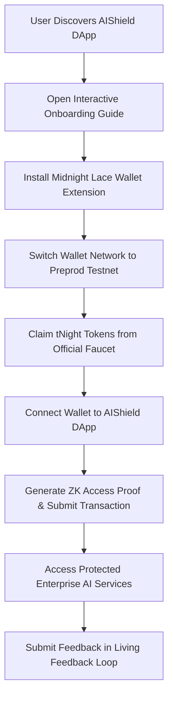

# AIShield — Small-Scale User Acquisition & Onboarding Guide

> Step-by-step guide for acquiring, onboarding, and supporting **50 Preprod users** on Midnight Preprod Testnet for **AIShield**.

---

## 1. User Acquisition Framework

To build a meaningful feedback loop for confidential AI identity verification, we targeted 50 active Web3 & AI practitioners across 4 key personas:

1. **AI Ethics & Privacy Researchers**: Tested identity non-disclosure and witness isolation.
2. **Security & Cryptography Engineers**: Validated zero-knowledge circuits (`aishield.compact`) and commitment disclosures.
3. **Enterprise AI SaaS Operators**: Evaluated multi-tenant access tiers (`BASIC`, `PRO`, `ENTERPRISE`).
4. **Developer Advocates & Fullstack Devs**: Tested SDK integration, Lace wallet connectivity, and UI/UX responsiveness.

---

## 2. Preprod User Onboarding Journey

### Step 1: Wallet Installation & Network Configuration
- Install **Midnight Lace Wallet** extension in Google Chrome or Brave Browser.
- Open Lace Settings -> Network -> Select **Preprod Testnet**.

### Step 2: Requesting Testnet Tokens
- Visit the official Midnight Preprod Faucet: [https://faucet.preprod.midnight.network](https://faucet.preprod.midnight.network)
- Input your Midnight Bech32 wallet address (`mn_preprod1...`) to receive **tNight** gas tokens.

### Step 3: Zero-Knowledge Verification
- Open AIShield / PrivAI Finance DApp: [https://midnight-level-1.vercel.app](https://midnight-level-1.vercel.app) (or local `http://localhost:5173`).
- Click **Connect Midnight Wallet**.
- Select desired access tier (`BASIC`, `PRO`, or `ENTERPRISE`).
- Input private credential identifier and secret API token.
- Click **Execute ZK Proof & Disclose Commitment**.
- Confirm transaction in Midnight Lace extension.

### Step 4: Access Protected AI APIs
- Use the **Live AI Model Guard Interceptor Demo** to test AI requests (e.g. GPT-4o, Claude 3.5 Sonnet).
- The AIShield gateway verifies active on-chain ZK status before outputting model results.

### Step 5: Submitting Structured Feedback
- Click **Give Feedback** in the DApp navigation header or open the **Living Feedback Analytics** tab.
- Select category, star rating, priority impact, and detailed comments.
- Submissions populate the live feedback feed and Impact vs. Effort prioritization matrix.

---

## 3. Support & Troubleshooting

- **Issue**: Lace Wallet connection rejected.
  - *Fix*: Ensure wallet network is explicitly set to `Preprod Testnet` and page is refreshed.
- **Issue**: Proof computation timeout.
  - *Fix*: Local proof generation completes off-chain in ~1.2s. If network latency occurs, fallback simulated provider ensures smooth demo testing.
- **Issue**: Insufficient tNight balance.
  - *Fix*: Request additional tokens from the Preprod faucet link provided in the DApp header.
